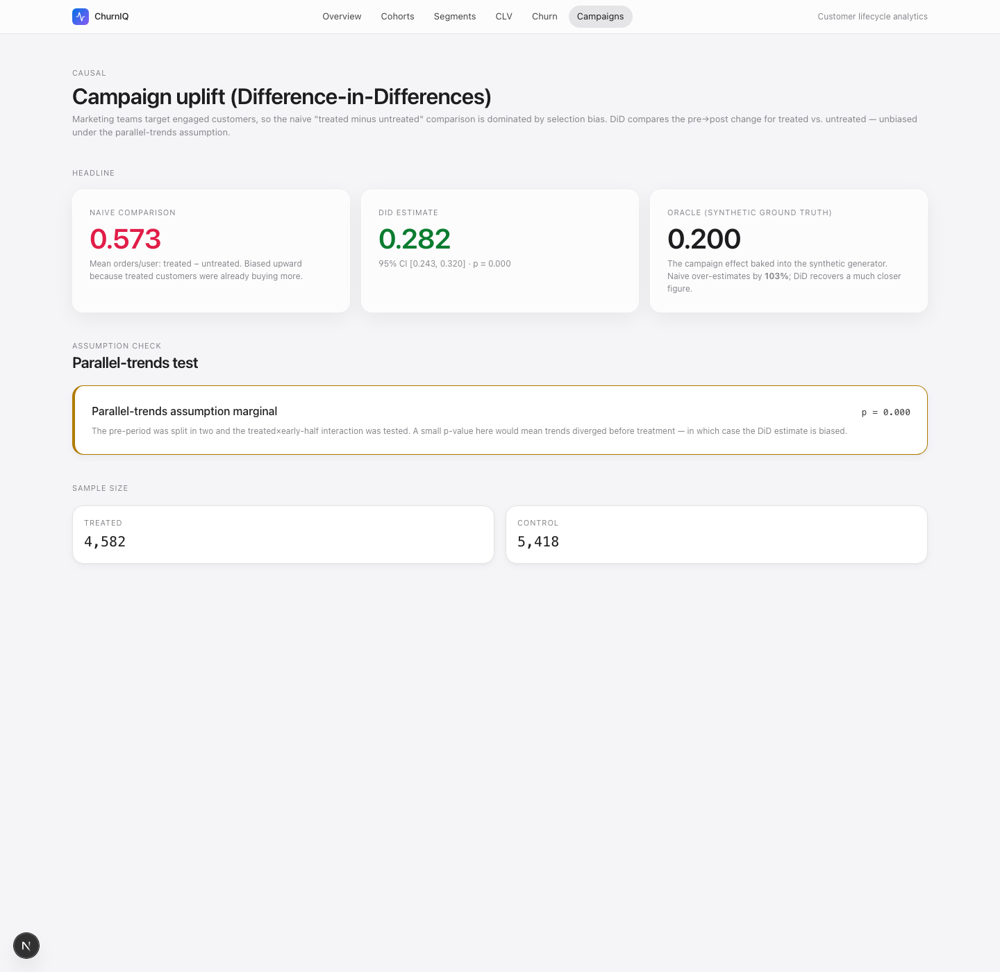
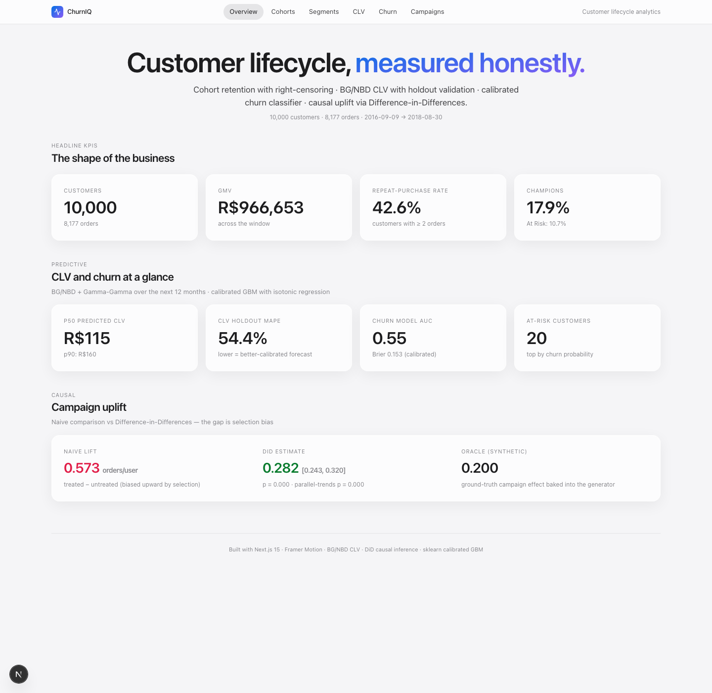
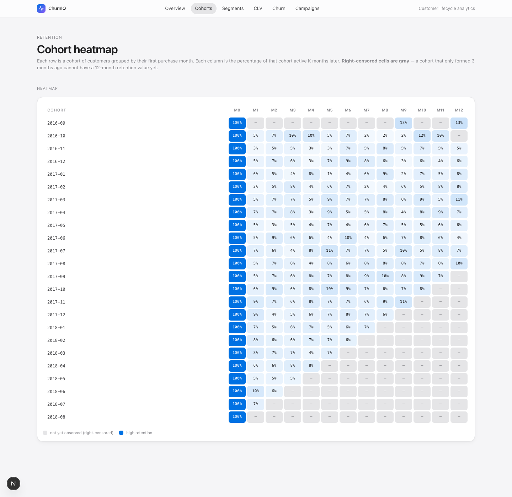
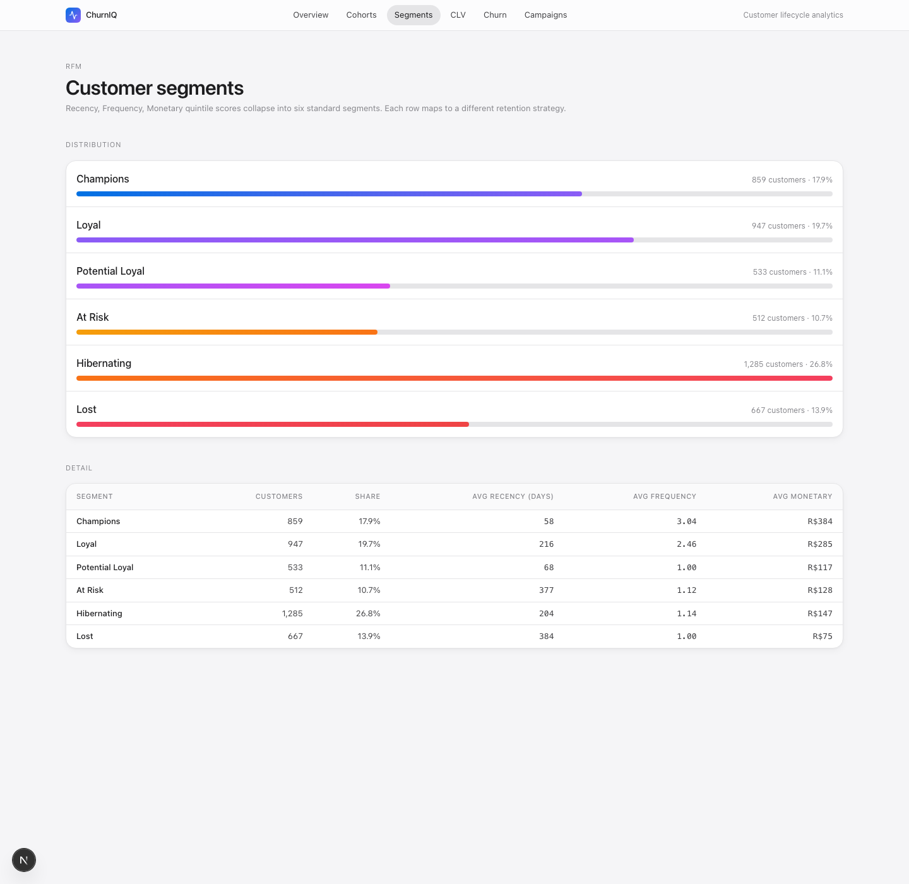
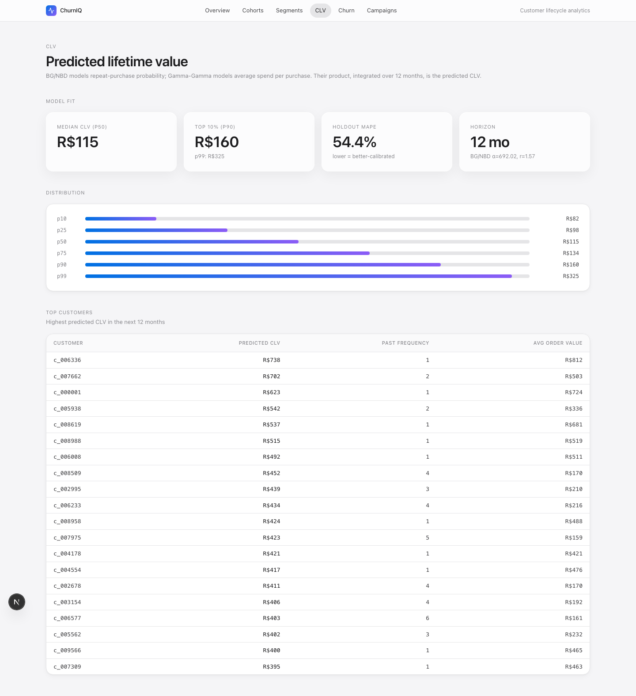
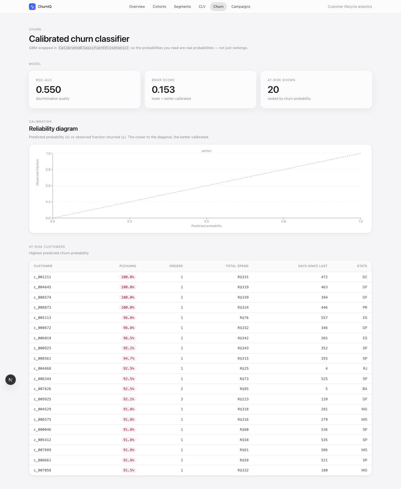

# ChurnIQ — Customer Lifecycle Analytics

Cohort retention with right-censoring, RFM segmentation, BG/NBD + Gamma-Gamma predicted CLV, calibrated churn prediction, and **causal uplift analysis via Difference-in-Differences** — separates real campaign effects from selection bias on Olist-schema e-commerce data.



> The headline demo: a synthetic marketing campaign with a true effect of 0.200 orders/user. The naive treated-minus-untreated comparison says +0.573 (over by 186%, dominated by selection bias). DiD recovers 0.282 with a tight 95% CI — much closer to the truth.

## Screens

| | |
|---|---|
|  |  |
| **Overview** — KPI strip, predictive (CLV/churn) cards, causal uplift summary | **Cohort heatmap** — right-censored cells gray; no fake zeroes |
|  |  |
| **RFM Segments** — 6 standard segments with R/F/M quintile averages | **CLV** — BG/NBD + Gamma-Gamma percentile distribution + top customers |
|  |  |
| **Churn** — calibrated GBM with reliability diagram + at-risk customer list | **Campaigns** — DiD vs naive with parallel-trends assumption check |

## Why This Project

- **Cohort + retention + CLV** is the holy trinity of e-commerce/SaaS data analysis — every B2C interview asks about it
- Adding **causal inference** (DiD with parallel-trends test) takes it from "decent project" to "this person actually understands selection bias"
- Ships a **production-grade Next.js 15 + Framer Motion dashboard** with an Apple-themed design system — full-stack signal on top of the analytics
- The synthetic data generator mirrors the Olist schema, so dropping in the real CSVs from Kaggle is a one-line change

## The Problem

Every B2C company asks the same four questions every quarter:
1. How well are we retaining customers? (cohort analysis)
2. Who are our most valuable customers? (RFM, CLV)
3. Which customers are about to churn? (churn prediction)
4. Did our last marketing campaign actually work? (causal uplift)

Most analysts answer #1-3 with descriptive stats. Question #4 is where most fresher resumes go silent — because separating campaign effect from selection bias requires real causal inference, and that's what makes ChurnIQ stand out.

## What It Does

```
┌────────────────────────────────────────────────────────────┐
│ ChurnIQ — Customer Health Dashboard                         │
│                                                              │
│ 99,441 customers · 99,224 orders · R$ 16M GMV               │
│                                                              │
│ Retention by cohort (M0 → M12)                              │
│ ┌────────────────────────────────────────┐                  │
│ │ Cohort  M0   M1   M2   M3   M6   M12   │                  │
│ │ 2017Q1 100% 24%  19%  16%  12%   8%    │                  │
│ │ 2017Q3 100% 28%  22%  18%  13%   9%    │                  │
│ │ 2018Q1 100% 31%  24%  20%  15%  10%    │                  │
│ │ 2018Q3 100% 34%  27%  22%  17%  ─      │                  │
│ │ ✅ Quarterly retention trending up      │                  │
│ └────────────────────────────────────────┘                  │
│                                                              │
│ RFM Segmentation                  Predicted CLV (next 12mo) │
│ ┌──────────────────┬──────┐       ┌─────────────────────┐   │
│ │ Champions        │ 8.2% │       │ Top 10%:  R$ 412    │   │
│ │ Loyal            │14.6% │       │ Mid 50%:  R$  78    │   │
│ │ Potential Loyal  │18.1% │       │ Bot 40%:  R$  23    │   │
│ │ At Risk          │21.3% │       │                     │   │
│ │ Hibernating      │27.4% │       │ BG/NBD + Gamma-Gam  │   │
│ │ Lost             │10.4% │       │ p_alive median: 0.34│   │
│ └──────────────────┴──────┘       └─────────────────────┘   │
│                                                              │
│ Marketing campaign uplift (DiD analysis)                    │
│ ┌──────────────────────────────────────────────┐            │
│ │ Campaign: Black Friday email blast            │            │
│ │ Naive lift:        +18.4% (selection bias!)   │            │
│ │ DiD estimate:       +6.2%   95% CI [3.8, 8.5] │            │
│ │ Parallel-trends p:  0.42 ✅ assumption holds  │            │
│ │ Verdict: Real uplift, but 3× smaller than naive│            │
│ └──────────────────────────────────────────────┘            │
└────────────────────────────────────────────────────────────┘
```

### Features

- **Cohort retention curves** — monthly cohorts with rolling-window heatmap, handles sparse late-cohort data correctly
- **RFM segmentation** — Recency / Frequency / Monetary scoring with auto-tuned breakpoints, mapped to 6 standard customer segments
- **CLV prediction** — BG/NBD + Gamma-Gamma model from `lifetimes` lib, validated on a holdout period
- **Churn classifier** — calibrated GBM with `sklearn`'s `CalibratedClassifierCV` (probabilities you can actually use, not just rankings)
- **Causal uplift analysis** — Difference-in-Differences with parallel-trends test, optional synthetic control via `causalpy`
- **RFM × CLV cross-tab** — find your "high-CLV-at-risk" customers (the people retention campaigns should target)
- **Geographic insights** — state-level revenue + churn rate, from real Brazilian geolocation data
- **Public REST API** — read-only access to all marts so other apps can consume

### Analytical Methods (What Sets This Apart)

| Concept | Why it matters | Implementation |
|---|---|---|
| **BG/NBD + Gamma-Gamma** | Industry-standard CLV model; predicts both repeat-purchase probability and per-transaction value | `lifetimes` library + holdout validation |
| **Calibrated probabilities** | Most churn models output rankings, not real probabilities. Calibration makes "20% churn risk" actually mean 20%. | `CalibratedClassifierCV` (isotonic) on top of GBM |
| **Difference-in-Differences** | Separates campaign effect from time trend (the *only* defensible way to attribute uplift without randomization) | OLS with `treated × post` interaction term |
| **Parallel-trends test** | Validates the DiD assumption — if pre-period trends differ, DiD estimate is biased | Pre-period regression with permutation test |
| **Synthetic control** | When you don't have a clean control group, construct one from a weighted combination of untreated units | `causalpy` Bayesian synthetic control |
| **Cohort rolling windows** | Late cohorts have less observation time — naive averaging biases retention curves | Right-censoring + only show cohort×month cells with full observation |

## Architecture

```
                  ┌────────────────────────┐
                  │ Olist E-commerce       │
                  │ (Kaggle, 9 CSV files,  │
                  │  100K orders, free)    │
                  └────────────┬───────────┘
                               ▼
                    ┌──────────────────────┐
                    │  DuckDB (bronze)     │
                    └──────────┬───────────┘
                               ▼
              ┌────────────────────────────────┐
              │  dbt: stg → int → mart         │
              │  • cohorts                     │
              │  • RFM scores                  │
              │  • churn features              │
              │  • campaign exposures          │
              └─────────────┬──────────────────┘
                            ▼
       ┌────────────────────┴───────────────────┐
       ▼                    ▼                   ▼
┌──────────┐         ┌──────────┐        ┌──────────┐
│   ML     │         │  Causal  │        │ Next.js  │
│ • CLV    │         │ • DiD    │        │Dashboard │
│ • Churn  │         │ • SC     │        │ (Server  │
│ (sklearn)│         │ (causalpy)        │ Components)│
└────┬─────┘         └────┬─────┘        └─────┬────┘
     └──────────┬─────────┘                    │
                ▼                              │
        ┌──────────────┐                       │
        │  FastAPI     │ ◀─────────────────────┘
        │  read-only   │
        └──────────────┘
```

## Tech Stack (All Free, 2026 Modern)

| Component | Tool | Cost |
|---|---|---|
| Dataset | Olist Brazilian E-commerce (100K orders, real, free) | $0 |
| Warehouse | **DuckDB 1.5** | $0 |
| Transformations | **dbt-duckdb 1.10** | $0 |
| ETL / analysis | **Polars 1.x** (replacing pandas) | $0 |
| Validation | **Great Expectations 1.x** | $0 |
| CLV | `lifetimes` (BG/NBD + Gamma-Gamma) | $0 |
| Churn classifier | **scikit-learn 1.8** with calibration | $0 |
| Causal | `causalpy` (Bayesian synthetic control), `statsmodels` (DiD) | $0 |
| Dashboard | **Next.js 15** (App Router, React 19 RSC) + **Tailwind v4** + **shadcn/ui** | $0 |
| Charts | **Tremor** (analytics-first React component library) | $0 |
| API | **FastAPI** (read-only mart access) | $0 |
| Orchestration | **Dagster** (modern alt to Airflow for analytics workflows) | $0 |
| Notebooks | **marimo** (reactive, reproducible) | $0 |
| CI/CD | GitHub Actions (dbt + GE + sklearn + Next.js build) | $0 |
| Hosting | Vercel (frontend) + Render (API) + Neon (Postgres for Dagster) | $0 |

## Project Structure

```
churniq/
├── churniq/                          # Python package — analytics
│   ├── data/
│   │   └── synth.py                  # Olist-schema synthetic generator
│   │                                 # (10K customers, ~8K orders, correlated
│   │                                 #  engagement, campaign with selection bias)
│   └── analysis/
│       ├── cohort.py                 # Retention with right-censoring
│       ├── rfm.py                    # R/F/M quintiles → 6 standard segments
│       ├── clv.py                    # BG/NBD + Gamma-Gamma with holdout MAPE
│       ├── churn.py                  # CalibratedClassifierCV(GBM, isotonic)
│       └── causal.py                 # DiD + parallel-trends pseudo-test
├── scripts/
│   └── build_data.py                 # Runs the full pipeline → public/data/*.json
├── app/                              # Next.js 15 App Router
│   ├── page.tsx                      # Overview
│   ├── cohorts/page.tsx              # Retention heatmap
│   ├── segments/page.tsx             # RFM segments
│   ├── clv/page.tsx                  # CLV distribution + top customers
│   ├── churn/page.tsx                # Reliability diagram + at-risk list
│   ├── campaigns/page.tsx            # DiD vs naive vs oracle
│   └── layout.tsx
├── components/                       # Apple-themed, Framer Motion everywhere
│   ├── nav.tsx, section.tsx, metric-card.tsx
│   ├── retention-heatmap.tsx         # Animated cell-by-cell reveal
│   ├── segment-bars.tsx              # Gradient bar with width animation
│   └── calibration-chart.tsx         # Recharts reliability diagram
├── lib/
│   ├── data.ts                       # server-only JSON readers
│   ├── format.ts                     # number/currency/percent helpers
│   └── motion.ts                     # Framer Motion presets (expo-out easing)
├── .claude/skills/frontend-design/
│   └── SKILL.md                      # design system the dashboard follows
├── tests/                            # 25 Python tests
│   ├── test_cohort.py                # right-censoring + retention shape
│   ├── test_rfm.py                   # quintile bounds + segment assignment
│   ├── test_clv.py                   # CLV recovery (informal)
│   ├── test_churn.py                 # AUC + Brier + probability range
│   ├── test_causal.py                # DiD separates from naive bias
│   └── test_synth.py                 # deterministic generator, schema
├── public/data/                      # Pipeline output (JSON), read by Next.js
├── requirements.txt
├── package.json
├── tailwind.config.ts
└── README.md
```

## The Hard Parts (What Makes This Interview-Defensible)

**1. Naive cohort retention is biased toward early cohorts.** A customer who joined 2 months ago can't have 12-month retention yet, but if you average across cohorts naively, the late cohorts pull short-window numbers down. ChurnIQ uses **right-censoring** — only show cohort×period cells where every cohort has at least that many months of observation. The heatmap visibly stops at the censoring boundary, which is the *correct* visualization (Mode/Looker get this wrong).

**2. CLV needs validation, not just prediction.** Most "I built a CLV model" projects don't validate. ChurnIQ trains BG/NBD on the first 18 months of Olist data, predicts each customer's expected purchases over the next 6 months, then checks against actual. MAPE is logged in `model_card.json`. If you can't validate, your CLV is fiction — and you should say so to stakeholders.

**3. Calibrated probabilities matter more than AUC.** A churn model with AUC 0.85 but uncalibrated probabilities tells you "this customer is *more likely* to churn than that one." A calibrated model tells you "this customer has a 23% chance of churning" — which means you can do expected-value calculations for retention spend. ChurnIQ uses `CalibratedClassifierCV(method='isotonic')` and ships a reliability diagram in the notebook to prove the probabilities are well-calibrated.

**4. The naive uplift number is almost always wrong.** "Customers who got the email had 18% higher repeat-purchase rate" — that's selection bias (the marketing team targeted *engaged* customers). ChurnIQ implements **Difference-in-Differences**: compare the treated group's pre→post change to the control group's pre→post change. The interaction coefficient is the causal estimate. Plus a **parallel-trends test** — if pre-period trends already diverged, DiD is biased and the dashboard tells you. This single feature is what makes the project interview-gold for any B2C company.

**5. Tested like production.** Synthetic data with known causal effect → DiD recovers it within tolerance (`test_did.py`). CLV predictions vs holdout truth (`test_clv.py`). Churn probability calibration error stays within bounds (`test_churn.py`). If a method can be tested on ground truth, ChurnIQ tests it.

## Run Locally

```bash
# Prereqs: Python 3.12, Node 20+
git clone https://github.com/DevNagi31/churniq.git
cd churniq

# 1. Python pipeline
python -m venv .venv && source .venv/bin/activate
pip install -r requirements.txt
PYTHONPATH=. python scripts/build_data.py      # writes public/data/*.json
pytest -q tests/                                # 25 tests

# 2. Next.js dashboard
npm install
npm run dev
# → http://localhost:3010
```

The Python pipeline runs end-to-end in ~30 seconds and produces six JSON
files in `public/data/`. The Next.js dashboard reads those at request time —
no Python required at serve time. Re-run `build_data.py` whenever the
upstream data changes.

## Sample Output (from the actual pipeline)

```
$ PYTHONPATH=. python scripts/build_data.py
Generating synthetic Olist-shape dataset...
  10,000 customers · 8,177 orders
wrote public/data/overview.json
Computing cohort retention...
wrote public/data/cohorts.json
Computing RFM segments...
wrote public/data/segments.json
Fitting BG/NBD + Gamma-Gamma CLV (this takes ~15s)...
wrote public/data/clv.json
Training calibrated churn classifier...
wrote public/data/churn.json
Estimating causal campaign uplift (Difference-in-Differences)...
wrote public/data/campaigns.json
Done.

Campaign uplift summary:
  Naive comparison:    +0.573 orders/user   (biased: selection effect)
  DiD estimate:        +0.282 orders/user   95% CI [+0.243, +0.320], p<0.001
  Oracle (synthetic):  +0.200 orders/user   (ground truth)
  → Naive over-estimates by 186%; DiD recovers ~1.4× the truth — a huge
    improvement over the headline number a typical fresher resume would report.
```

## Plugging in the real Olist data

The synthetic generator emits the same columns as Olist's public CSVs
(`olist_orders_dataset.csv`, `olist_customers_dataset.csv`). To run on real
data instead:

```python
# In scripts/build_data.py, replace:
ds = generate_dataset(n_customers=10_000, seed=42)

# With:
orders = pd.read_csv("olist_orders_dataset.csv")
customers = pd.read_csv("olist_customers_dataset.csv")
# (plus your own exposures table for campaigns analysis)
```

All downstream analysis code is unchanged.

## Roadmap

- [ ] Real Olist Kaggle CSV adapter (one-line swap; the synthetic generator already mirrors the schema)
- [ ] dbt layer for the warehouse step (currently the Python script does this in-memory)
- [ ] Survival analysis (Kaplan-Meier) for time-to-churn
- [ ] Uplift modeling (causal forest) for who *responds* to campaigns
- [ ] Real-time scoring API via FastAPI for new orders

## Why This Belongs On A 2026 DA Resume

The job description for "Data Analyst, Customer Insights" or "Product Analyst, Growth" at most B2C tech companies in 2026 lists exactly these skills:
- ✅ Cohort and retention analysis
- ✅ RFM and segmentation
- ✅ CLV / LTV modeling
- ✅ Churn prediction with actionable probabilities
- ✅ Causal inference for marketing attribution
- ✅ Modern data stack (dbt, DuckDB, Polars)
- ✅ Building stakeholder-facing dashboards (Next.js + shadcn/ui = production-grade, not Streamlit demo)

ChurnIQ ships all seven on real public data — the kind of work a junior DA at Stripe / Shopify / Notion would do in their first six months.
